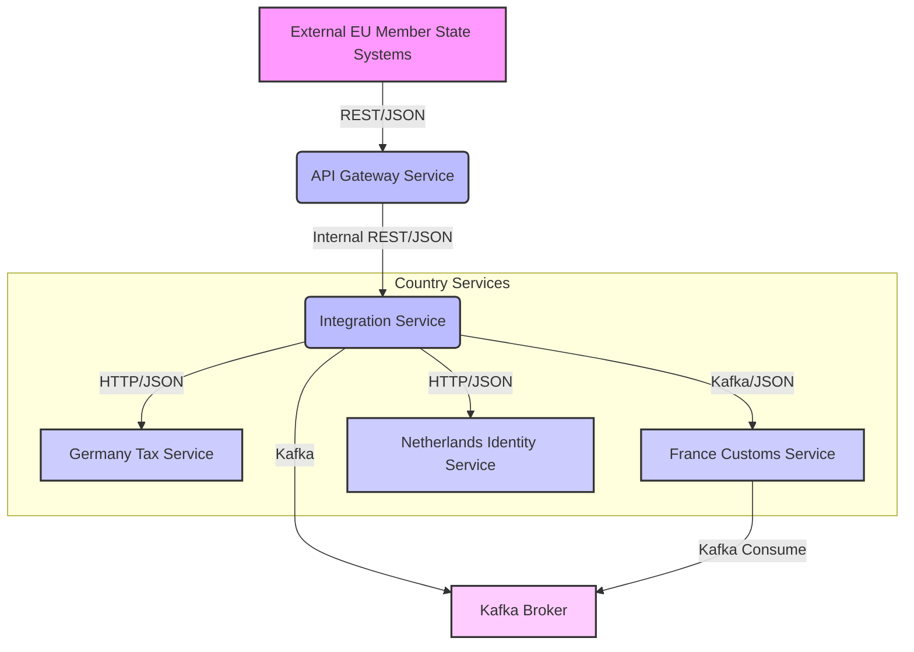

# EU Cross-Border Public Service Data Exchange Platform

## Introduction

This project demonstrates a robust and scalable **Cross-Border Public Service Data Exchange Platform** for the European Union, built using **Java 17**, **Spring Boot**, and **Apache Camel**. It simulates a real-world scenario where heterogeneous systems across member states (e.g., tax, customs, healthcare, identity verification) need to exchange data securely and efficiently. Apache Camel acts as a crucial integration layer, addressing challenges such as diverse protocols, data formats, security models, and reliability requirements.

Apache Camel is widely used in enterprise and government integration scenarios, including healthcare and public sector platforms in Europe [1]. Its powerful Enterprise Integration Patterns (EIPs) and extensive component library make it an ideal choice for complex integration landscapes like the EU's digital infrastructure.

## Architecture Diagram



### Why Apache Camel?

Apache Camel is utilized in this platform for several key reasons, directly addressing the complexities of EU digital integration:

*   **Different Protocols and Formats**: EU member states operate diverse systems using various communication protocols (HTTP, FTP, messaging) and data formats (JSON, XML, EDI). Camel's extensive component library (over 300 components) allows seamless connectivity and transformation between these disparate systems, abstracting away the underlying technical differences. This project demonstrates JSON to XML transformation capabilities (though mocked for simplicity in the Germany route).
*   **Reliability and Error Handling**: Cross-border data exchange requires high reliability. Camel's EIPs like Dead Letter Channel (DLC) provide robust error handling, retry mechanisms, and fault tolerance, ensuring that messages are not lost and failures are managed gracefully. This is critical for sensitive public service data.
*   **Decoupling Systems**: Camel acts as an intermediary, decoupling the sender and receiver systems. This means changes in one system's interface or protocol do not necessarily impact others, fostering agility and reducing dependencies in a large, distributed environment. The API Gateway and Integration Service exemplify this decoupling.
*   **Orchestration and Routing**: Complex business processes often involve orchestrating calls across multiple services and routing data based on content. Camel's Content-Based Router (CBR) and orchestration capabilities (e.g., Splitter, Aggregator) enable dynamic routing and sophisticated workflow management, which is essential for directing public service data to the correct national systems based on specific criteria (e.g., country code).
*   **Scalability and Performance**: Camel is lightweight and can be deployed in various environments, from standalone applications to microservices and cloud-native architectures. Its asynchronous processing capabilities and integration with messaging systems like Kafka support high-throughput, scalable data exchange.

## Project Structure

The project is a multi-module Maven build:

```
eu-integration-platform
├── pom.xml             (Parent POM)
├── api-gateway
│   ├── pom.xml
│   └── src
│       ├── main
│       │   ├── java/eu/platform/gateway
│       │   │   ├── ApiGatewayApplication.java
│       │   │   └── route/ApiGatewayRouteBuilder.java
│       │   └── resources/application.yml
│       └── test/java/eu/platform/gateway/route/ApiGatewayRouteTest.java
├── common-lib
│   ├── pom.xml
│   └── src
│       └── main
│           └── java/eu/platform/common/dto
│               ├── CrossBorderRequest.java
│               ├── CrossBorderResponse.java
│               └── DataEntry.java
├── country-services
│   ├── france-customs
│   │   ├── pom.xml
│   │   └── src
│   │       ├── main
│   │       │   ├── java/eu/platform/france/FranceCustomsApplication.java
│   │       │   └── resources/application.yml
│   │       └── test
│   ├── germany-tax
│   │   ├── pom.xml
│   │   └── src
│   │       ├── main
│   │       │   ├── java/eu/platform/germany/GermanyTaxApplication.java
│   │       │   └── resources/application.yml
│   │       └── test
│   └── netherlands-identity
│       ├── pom.xml
│       └── src
│           ├── main
│           │   ├── java/eu/platform/netherlands/NetherlandsIdentityApplication.java
│           │   └── resources/application.yml
│           └── test
└── integration-service
    ├── pom.xml
    └── src
        ├── main
        │   ├── java/eu/platform/integration
│       │   │   ├── IntegrationServiceApplication.java
│       │   │   └── route/IntegrationRouteBuilder.java
│       │   └── resources/application.yml
│       └── test/java/eu/platform/integration/route/IntegrationRouteTest.java
```

## How to Run Services

This project requires **Java 17** and **Maven**. It also uses **Kafka** for asynchronous messaging. You'll need a running Kafka broker (e.g., via Docker).

### 1. Start Kafka (if not already running)

If you have Docker installed, you can start a local Kafka instance using `docker-compose` or a simple `docker run` command. For example, using a `docker-compose.yml`:

```yaml
version: '3'
services:
  zookeeper:
    image: confluentinc/cp-zookeeper:7.0.1
    hostname: zookeeper
    container_name: zookeeper
    ports:
      - "2181:2181"
    environment:
      ZOOKEEPER_CLIENT_PORT: 2181
      ZOOKEEPER_TICK_TIME: 2000

  broker:
    image: confluentinc/cp-kafka:7.0.1
    hostname: broker
    container_name: broker
    depends_on:
      - zookeeper
    ports:
      - "9092:9092"
      - "9101:9101"
    environment:
      KAFKA_BROKER_ID: 1
      KAFKA_ZOOKEEPER_CONNECT: 'zookeeper:2181'
      KAFKA_LISTENER_SECURITY_PROTOCOL_MAP: PLAINTEXT:PLAINTEXT,PLAINTEXT_HOST:PLAINTEXT
      KAFKA_ADVERTISED_LISTENERS: PLAINTEXT://broker:29092,PLAINTEXT_HOST://localhost:9092
      KAFKA_OFFSETS_TOPIC_REPLICATION_FACTOR: 1
      KAFKA_TRANSACTION_STATE_LOG_MIN_ISR: 1
      KAFKA_TRANSACTION_STATE_LOG_REPLICATION_FACTOR: 1
      KAFKA_GROUP_INITIAL_REBALANCE_DELAY_MS: 0
      KAFKA_JMX_PORT: 9101
      KAFKA_JMX_HOSTNAME: localhost
```

Save this as `docker-compose.yml` and run `docker-compose up -d`.

### 2. Build the Project

Navigate to the root directory of the project (`eu-integration-platform`) and build all modules:

```bash
mvn clean install
```

### 3. Run Each Service

Open separate terminal windows for each service and run them using Maven Spring Boot plugin:

**Germany Tax Service (Port 8082)**
```bash
cd country-services/germany-tax
mvn spring-boot:run
```

**France Customs Service (Port 8083)**
```bash
cd country-services/france-customs
mvn spring-boot:run
```

**Netherlands Identity Service (Port 8084)**
```bash
cd country-services/netherlands-identity
mvn spring-boot:run
```

**Integration Service (Port 8081)**
```bash
cd integration-service
mvn spring-boot:run
```

**API Gateway Service (Port 8080)**
```bash
cd api-gateway
mvn spring-boot:run
```

Ensure all services are running before sending requests to the API Gateway.

## Example cURL Commands

All requests go through the API Gateway.

### 1. German Tax Data Request (Content-Based Routing, Splitter, Aggregator)

This request will be routed to the `germany-tax` service. The `integration-service` will split the `entries` and process them individually.

```bash
curl -X POST http://localhost:8080/gateway/v1/exchange \
-H "Content-Type: application/json" \
-H "Authorization: Bearer valid-jwt-token" \
-d '{
  "requestId": "REQ-DE-TAX-001",
  "countryCode": "DE",
  "serviceType": "TAX",
  "entries": [
    {"key": "taxId", "value": "DE123456789"},
    {"key": "income", "value": "50000"}
  ]
}'
```

Expected Response (simplified):
```json
{
  "requestId": "...",
  "status": "SUCCESS",
  "message": "German tax data processed successfully",
  "processedBy": "Germany-Integration-Adapter",
  "data": null
}
```

### 2. French Customs Data Request (Kafka Asynchronous Processing)

This request will be routed to the `france-customs` service via Kafka, demonstrating asynchronous processing.

```bash
curl -X POST http://localhost:8080/gateway/v1/exchange \
-H "Content-Type: application/json" \
-H "Authorization: Bearer valid-jwt-token" \
-d '{
  "requestId": "REQ-FR-CUST-001",
  "countryCode": "FR",
  "serviceType": "CUSTOMS",
  "entries": [
    {"key": "declarationId", "value": "FR987654321"},
    {"key": "goodsValue", "value": "10000"}
  ]
}'
```

Expected Response (simplified, indicating asynchronous processing):
```json
{
  "requestId": null,
  "status": "PENDING",
  "message": "Request forwarded to France Customs asynchronously",
  "processedBy": null,
  "data": null
}
```

### 3. Netherlands Identity Verification Request

This request will be routed to the `netherlands-identity` service.

```bash
curl -X POST http://localhost:8080/gateway/v1/exchange \
-H "Content-Type: application/json" \
-H "Authorization: Bearer valid-jwt-token" \
-d '{
  "requestId": "REQ-NL-ID-001",
  "countryCode": "NL",
  "serviceType": "IDENTITY",
  "entries": [
    {"key": "citizenId", "value": "NL112233445"},
    {"key": "dob", "value": "1980-01-01"}
  ]
}'
```

Expected Response (simplified):
```json
{
  "requestId": "REQ-NL-ID-001",
  "status": "SUCCESS",
  "message": "Netherlands Identity Service verified request",
  "processedBy": "NL-DigiD-Simulator",
  "data": null
}
```

### 4. Unauthorized Request (Missing Token)

```bash
curl -X POST http://localhost:8080/gateway/v1/exchange \
-H "Content-Type: application/json" \
-d '{
  "requestId": "REQ-UNAUTH-001",
  "countryCode": "DE",
  "serviceType": "TAX",
  "entries": []
}'
```

Expected Response:
```json
{
  "requestId": null,
  "status": "FAILURE",
  "message": "Unauthorized: Missing or invalid token",
  "processedBy": null,
  "data": null
}
```

### 5. Unsupported Country Code Request (Dead Letter Channel)

```bash
curl -X POST http://localhost:8080/gateway/v1/exchange \
-H "Content-Type: application/json" \
-H "Authorization: Bearer valid-jwt-token" \
-d '{
  "requestId": "REQ-UNSUP-001",
  "countryCode": "UK",
  "serviceType": "CUSTOMS",
  "entries": []
}'
```

Expected Response (simplified, indicating internal server error due to unsupported country):
```json
{
  "requestId": null,
  "status": "FAILURE",
  "message": "Internal Server Error in Gateway",
  "processedBy": null,
  "data": null
}
```

## References

[1] Apache Camel. (n.d.). *Who uses Apache Camel?*. Retrieved from [https://camel.apache.org/users/](https://camel.apache.org/users/)
